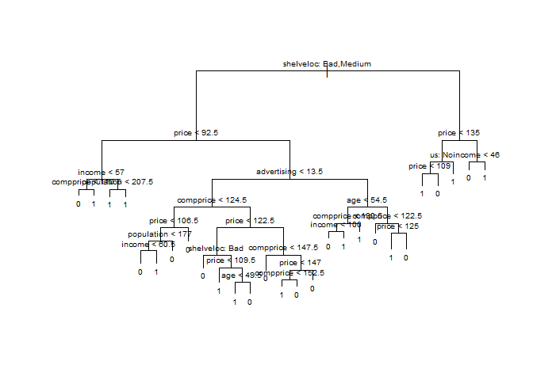
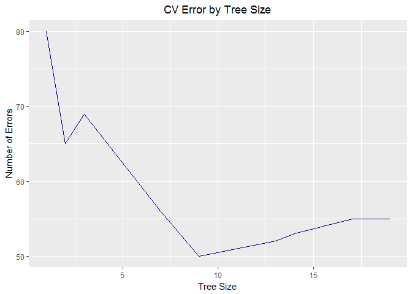
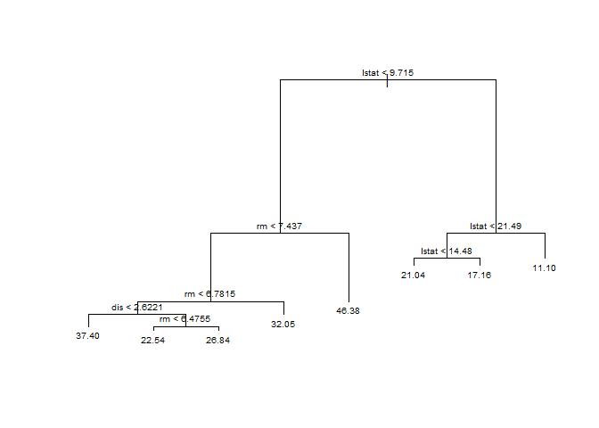
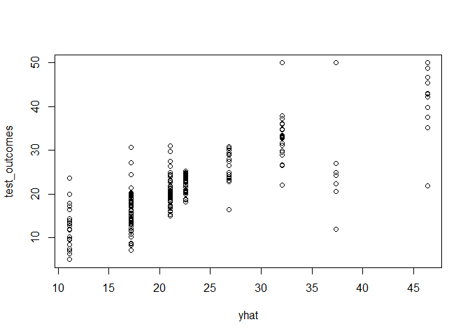
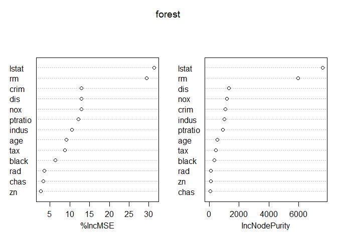
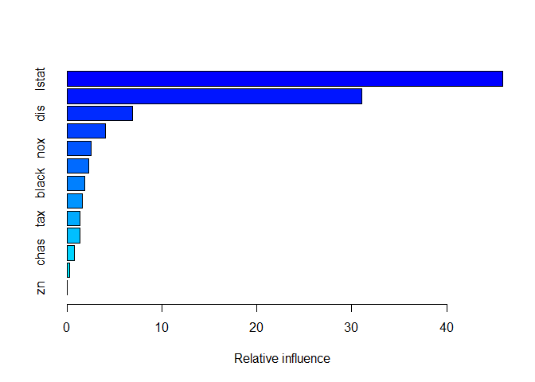

Chapter 8 Lab: Decision Trees
================
William Morgan

8.3.1: Fitting Classification Trees
-----------------------------------

The `tree` library is used to construct classification and regression trees. We'll be using the `Carseats` data from the `ISLR` library. Instead of using the continuous variable `Sales` we will create our own dummy variable to indicate sales greater than 8

``` r
data <- Carseats %>%
  mutate(high = factor(if_else(Sales > 8, 1, 0)))

names(data) <-  str_to_lower(names(data))
```

`tree::tree()` will allow us to fit the classification tree to predict the variable we just created. The first argument is the only thing we need to worry about at this point. We simply need to insert the formula that will be used to make our predictions, similar to `lm()`. There are a variety of packages available to perform recursive partitioning, like `rpart` and `ctree`. If you would like to learn more, you can visit [this](https://www.r-bloggers.com/a-brief-tour-of-the-trees-and-forests/) blog post about available methods.

``` r
# Set up initial tree
tree <- tree(high ~ . -sales, data)
```

The output from this tree is stored in a list, which we can summarize in order to view the variables that are used in internal nodes, the number of terminal nodes, and the training error rate. You can also just call on the object itself to get the entire representation of the tree. Terminal nodes are denoted with asterisks. To save space, we exclude that from this document

``` r
summary(tree)
```

    ## 
    ## Classification tree:
    ## tree(formula = high ~ . - sales, data = data)
    ## Variables actually used in tree construction:
    ## [1] "shelveloc"   "price"       "income"      "compprice"   "population" 
    ## [6] "advertising" "age"         "us"         
    ## Number of terminal nodes:  27 
    ## Residual mean deviance:  0.4575 = 170.7 / 373 
    ## Misclassification error rate: 0.09 = 36 / 400

We know that trees can be easily be visually interpreted, so let's check out what our test case looks like. Be wary of doing any plotting because the tree can easily grow out of control and make the graph impossible to read. We can see that in the following plot of our current results:



In order to evaluate a classification tree we need to use training and testing sets. Let's now repeat what we did above, this time including the calculation for the test error rate.

``` r
# Define our training/testing sets
set.seed(2)
train <- sample_n(data, 200)
test <-  setdiff(data, train)

# Run the recursive partioning algorithm
ttree <- tree(high ~. -sales, train)

# Make predictions and display confusion matrix
test_predictions <- predict(ttree, test, type = 'class')
table(test_predictions, test$high)
```

    ##                 
    ## test_predictions  0  1
    ##                0 86 27
    ##                1 30 57

``` r
(86 + 57) / 200
```

    ## [1] 0.715

We can now add on another layer of complexity by pruning our results. Recall that unpruned trees are prone to overfitting the data, so our method will be to watch variation in test error rates as we increase the penalty in the number of terminal nodes. To refresh your memory, we summarize **Algorithm 8.1** below:

##### **Algorithm 8.1: Pruning Trees**

1.  Grow your original tree *T*<sub>0</sub> using your training data

2.  As a function of *α* (the penalty parameter), define a sequence of best subtrees

3.  Use K-fold cross-validation to find the *α* that minimizes the average mean squared prediction error of the *k*th fold of the training data

4.  Find the best subtree from Step 2 using the *α* found in the previous step

Luckily, `tree::cv.tree` contains will be doing most of the work for us. It will perform the cross-validation required to determine the optimal tree size. It also allows us to choose the function by which the tree is pruned. In this case, we pruning will be guided by the classification error rate.

``` r
set.seed(3)
cv_tree <- cv.tree(ttree, FUN = prune.misclass)
cv_tree
```

    ## $size
    ## [1] 19 17 14 13  9  7  3  2  1
    ## 
    ## $dev
    ## [1] 55 55 53 52 50 56 69 65 80
    ## 
    ## $k
    ## [1]       -Inf  0.0000000  0.6666667  1.0000000  1.7500000  2.0000000
    ## [7]  4.2500000  5.0000000 23.0000000
    ## 
    ## $method
    ## [1] "misclass"
    ## 
    ## attr(,"class")
    ## [1] "prune"         "tree.sequence"

Most important in these results is `$dev`, which corresponds to the cross-validation error in each instance. We can see that the smallest value occurs when there are 9 terminal nodes. Let's take a quick look at how the error varies in the our number of terminal nodes:



Now that we know how exactly how many terminal nodes we want, we prune our tree with `prune.misclass()` to obtain the optimal tree. Then, check to see if this tree performs any better on the testing set than the base tree *T*<sub>0</sub> did.

``` r
pruned <- prune.misclass(ttree, best = 9)

test_predictions <- predict(pruned, test, type = 'class')
table(test_predictions, test$high)
```

    ##                 
    ## test_predictions  0  1
    ##                0 94 24
    ##                1 22 60

``` r
(94 + 60) / 200
```

    ## [1] 0.77

------------------------------------------------------------------------

8.3.2 Fitting Regression Trees
------------------------------

Not much changes in terms of the code when we switch to regression trees, so this section will pretty much be a recap of the previous one, just using different data. We pull the `Boston` data set from the `MASS` library for this exercise.

``` r
set.seed(1)
train <- sample_frac(Boston, .5) 
test <-  setdiff(Boston, train)

tree_train <- tree(medv ~ ., train)
summary(tree_train)
```

    ## 
    ## Regression tree:
    ## tree(formula = medv ~ ., data = train)
    ## Variables actually used in tree construction:
    ## [1] "lstat" "rm"    "dis"  
    ## Number of terminal nodes:  8 
    ## Residual mean deviance:  12.65 = 3099 / 245 
    ## Distribution of residuals:
    ##      Min.   1st Qu.    Median      Mean   3rd Qu.      Max. 
    ## -14.10000  -2.04200  -0.05357   0.00000   1.96000  12.60000

``` r
plot(tree_train)
text(tree_train, pretty = 0, cex = .65)
```



As you can see `lstat < 9.715` is the first partition in this tree. The variable measures the percentage of individuals with lower socioeconomic status in the immediate area. Based off of the terminal nodes stemming from the left side of the tree, this suggests that higher socioeconomic geographic areas end up with much larger median house prices.

We can now move on to see if pruning will increase the performance of this tree

``` r
cv_tree <- cv.tree(tree_train)

# Get an idea of change in error by changing tree size
ggplot(data = data.frame(cv_tree$size, cv_tree$dev),
  aes(x = cv_tree$size, y = cv_tree$dev)) +
  geom_line(color = "darkblue") +
  labs(x = "Tree Size", y = "Number of Errors", title = "CV Error by Tree Size") +
  theme(plot.title = element_text(hjust = .5))
```


``` r
# Predict, plot, and calculate MSE
yhat <- predict(tree_train, newdata = test)
test_outcomes <- test$medv

plot(yhat, test_outcomes)
```



``` r
mean((yhat - test_outcomes)^2)
```

    ## [1] 25.04559

------------------------------------------------------------------------

8.3.3: Bagging and Random Forests
---------------------------------

We'll be using the same data from the previous section and the `randomForest` package to help us accomplish some simple examples. We begin with a bagging example, where all predictors are used in each split.

``` r
set.seed(1)

# Set up the randomForest for the bagging case (all vars included)
bag <- randomForest(medv ~ ., train,
                    mtry = 13, importance = TRUE) # recall that `train` and `test` and are made in 8.3.2
bag
```

    ## 
    ## Call:
    ##  randomForest(formula = medv ~ ., data = train, mtry = 13, importance = TRUE) 
    ##                Type of random forest: regression
    ##                      Number of trees: 500
    ## No. of variables tried at each split: 13
    ## 
    ##           Mean of squared residuals: 11.02509
    ##                     % Var explained: 86.65

``` r
# Calculate MSE of the testing set for the bagged regression tree
yhat <- predict(bag, test)
mean((yhat - test$medv)^2)
```

    ## [1] 13.47349

Compare the MSE of the bagged random forest to the optimally-pruned single tree found in 8.3.2 - it's much lower. We manually changed the amount of variables at each split in the above bagging example, but we might achieve even better results using a more general random forest. By default, `randomForest` uses *p*/3 variables when building a forest of regression trees and $\\sqrt p$ for classification trees. In the following example, we will use `mtry=6` (*m* ≈ *p*/2).

``` r
forest <- randomForest(medv ~., train, mtry = 6, importance = TRUE)

yhat <- predict(forest, test)
mean((yhat - test$medv)^2)
```

    ## [1] 11.22316

We find that this approach worked - our MSE is now reduced to 11.37, lower than the previous two methods we tried.

Once we find an adequate forest, we can check out how important each variable is using `importance()`.

``` r
importance(forest)
```

    ##           %IncMSE IncNodePurity
    ## crim    12.988089    1078.43531
    ## zn       2.714889      76.50506
    ## indus   10.545100    1012.00217
    ## chas     3.263686      52.61111
    ## nox     12.906528    1156.33584
    ## rm      29.407391    5989.54048
    ## age      9.113592     521.17351
    ## dis     12.933480    1293.35669
    ## rad      3.594655     100.35282
    ## tax      8.819588     414.65202
    ## ptratio 12.224736     888.90254
    ## black    6.358499     336.69694
    ## lstat   31.387814    7645.22905

The first column represents the mean decrease in accuracy of the prediction when the variable is removed from the model, and the second column is a measure of the total decrease in node impurity resulting from splits over that variable (averaged over all of the trees)

`randomForest::varImpPlot()` plots these importance measures for us

``` r
varImpPlot(forest)
```



8.3.4 Boosting
--------------

We'll be using the `gbm` package to help us fit boosted regression trees to the `Boston` data set, which you should be familiar with by now.

``` r
boosted <- gbm(medv ~ ., train, distribution = 'gaussian', # regression => distr = 'gaussian'
               n.trees = 5000, interaction.depth = 4)

# Summarize and produce a quick plot to highlight importance of variables
summary(boosted)
```



    ##             var     rel.inf
    ## lstat     lstat 45.91501457
    ## rm           rm 31.05020061
    ## dis         dis  6.92989912
    ## crim       crim  4.04352442
    ## nox         nox  2.56699881
    ## ptratio ptratio  2.29883121
    ## black     black  1.85031399
    ## age         age  1.59946739
    ## tax         tax  1.35432268
    ## indus     indus  1.33072516
    ## chas       chas  0.81218915
    ## rad         rad  0.23766362
    ## zn           zn  0.01084927

Let's now plot the marginal effect of these top two variables, `lstat` and `rm`

``` r
par(mfrow = c(1,2))
plot(boosted, i = 'rm')
plot(boosted, i = 'lstat')
```


Alright - this just confirmed what we should have already been expecting: median house values are decreasing in `lstat` and increasing in `rm`

Let's now test how well this boosted regression tree performs on the testing data

``` r
yhat <- predict(boosted, newdata = test, n.trees = 5000)
mean((yhat - test$medv)^2)
```

    ## [1] 11.8833

Not amazing, but not bad. The boosted model performed just around the same as the random forests and superior to the bagging model, but we might be able to squeeze out some extra performance by changing the shrinkage parameter *λ*. The default value is .001, but let's bump it up to *λ* = .2

``` r
boosted <- gbm(medv ~. , train, distribution = 'gaussian',
               n.trees = 5000, interaction.depth = 4,
               shrinkage = .2, verbose = F)
yhat <- predict(boosted, newdata = test, n.trees = 5000)
mean((yhat - test$medv)^2)
```

    ## [1] 11.78647

Changing the shrinkage parameter actually made a difference - we're now just slightly under what we got from the previous model where it was equal to .001
