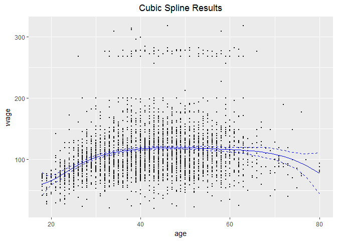
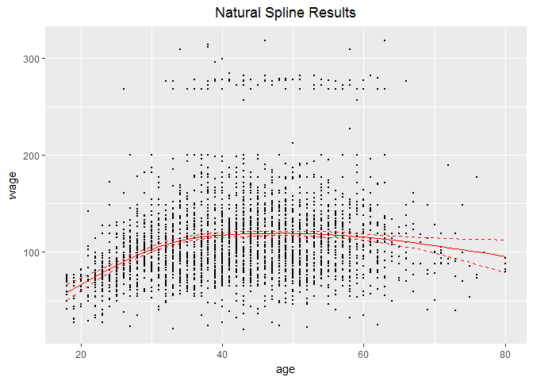
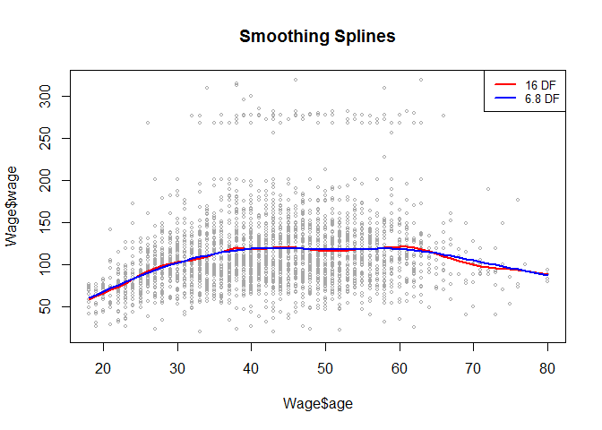
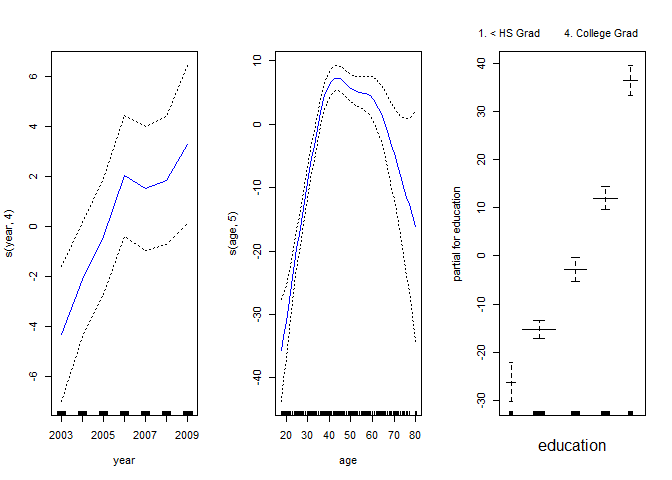
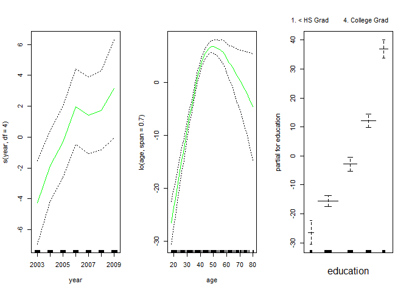
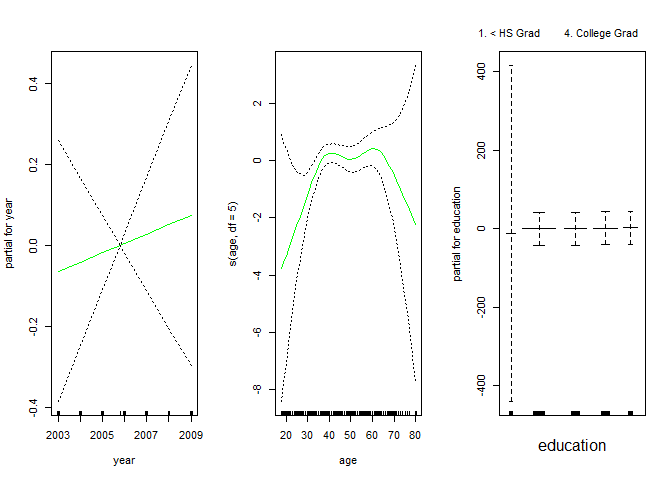

Chapter 7 Lab: Moving Beyond Linearity
================

Throughout this lab we will be using the same `Wage` data that has been considered in previous chapters. At a glance, this lab will cover the following topics:

-   Polynomial Regression and Step Functions

-   Regression Splines (Natural, Smoothing)

-   General Additive Models (GAMs)

7.8.1: Polynomial Regression and Step Functions
-----------------------------------------------

Polynomial regression is super easy to implement in `R`. We follow the basic steps required to do linear regression with `lm()` and adjust some small things to include polynomial expressions in the formula

Before we begin, just a quick aside - normally I don't use `attach()` in my own work because it can get confusing what data is currently attached and which columns you are calling. In this scenario, because we are only working with one data set through the majority of this lab attaching the data is much less problematic

``` r
# Bring in the Wage data and run a fourth-degree polynomial regression
attach(Wage)
fit <- lm(wage ~ poly(age, 4), data = Wage)
coef(summary(fit))
```

    ##                 Estimate Std. Error    t value     Pr(>|t|)
    ## (Intercept)    111.70361  0.7287409 153.283015 0.000000e+00
    ## poly(age, 4)1  447.06785 39.9147851  11.200558 1.484604e-28
    ## poly(age, 4)2 -478.31581 39.9147851 -11.983424 2.355831e-32
    ## poly(age, 4)3  125.52169 39.9147851   3.144742 1.678622e-03
    ## poly(age, 4)4  -77.91118 39.9147851  -1.951938 5.103865e-02

By default, `poly()` returns orthogonal polynomials from degree 1 to degree 4. That might seem a little confusing, so we can use the `raw = TRUE` option to specify that we want *age*, *age^2*, *age^3*, and *age^4* directly.

``` r
fit2 <- lm(wage ~ poly(age, 4, raw = TRUE), data = Wage)
coef(summary(fit))
```

    ##                 Estimate Std. Error    t value     Pr(>|t|)
    ## (Intercept)    111.70361  0.7287409 153.283015 0.000000e+00
    ## poly(age, 4)1  447.06785 39.9147851  11.200558 1.484604e-28
    ## poly(age, 4)2 -478.31581 39.9147851 -11.983424 2.355831e-32
    ## poly(age, 4)3  125.52169 39.9147851   3.144742 1.678622e-03
    ## poly(age, 4)4  -77.91118 39.9147851  -1.951938 5.103865e-02

There are several other ways to do the same thing - you can either use the wrapper `I()` (as `^` is interpreted as a call to interact variables), or simply just use `cbind()`. We've excluded the output from these extra methods, but have included the code so you can see how they are implemented

``` r
# Using I()
lm(wage ~ age + I(age^2) + I(age^3) + I(age^4), data = Wage) %>%
  coef()

# Using cbind()
lm(wage ~ cbind(age, age^2, age^3, age^4), data = Wage) %>%
  coef()
```

Let's take a look at the fitted model to see how well it performs. We'll be using the `modelr` package to help us add a confidence interval around the fit. Since there isn't any difference in outcome between the `poly(..., raw = TRUE)` and previous two mdoels we will just stick with `fit2` for the time being


We kind of arbitrarily set up this 4-degree polynomial fit, so how do we know if its the right one to use? We can use hypothesis testing to determine which degree polynomial is most appropriate

``` r
fit1 <- lm(wage~age, data = Wage)
fit2 <- lm(wage~poly(age, 2), data = Wage)
fit3 <- lm(wage~poly(age, 3), data = Wage)
fit4 <- lm(wage~poly(age, 4), data = Wage)
fit5 <- lm(wage~poly(age, 5), data = Wage)

anova(fit1, fit2, fit3, fit4, fit5)
```

    ## Analysis of Variance Table
    ## 
    ## Model 1: wage ~ age
    ## Model 2: wage ~ poly(age, 2)
    ## Model 3: wage ~ poly(age, 3)
    ## Model 4: wage ~ poly(age, 4)
    ## Model 5: wage ~ poly(age, 5)
    ##   Res.Df     RSS Df Sum of Sq        F    Pr(>F)    
    ## 1   2998 5022216                                    
    ## 2   2997 4793430  1    228786 143.5931 < 2.2e-16 ***
    ## 3   2996 4777674  1     15756   9.8888  0.001679 ** 
    ## 4   2995 4771604  1      6070   3.8098  0.051046 .  
    ## 5   2994 4770322  1      1283   0.8050  0.369682    
    ## ---
    ## Signif. codes:  0 '***' 0.001 '**' 0.01 '*' 0.05 '.' 0.1 ' ' 1

Its clear that a linear fit isn't sufficient, and that even a cubic fit would outperform a quadratic. The quartic fit is nearing significance, but it can be up to you whether the cubic or the quartic will be better.You could also find the best degree polynomial fit by using Cross-Validation, butthat is not covered here.

Step Functions are rather easy to set up; we basically only need `cut()` to help us split up the predictor that we want to create our 'steps' from. It works by converting a numeric into an ordered factor, which will then be 'dummified' when we fit out model

``` r
# Example how cut() works
table(cut(age, 4))
```

    ## 
    ## (17.9,33.5]   (33.5,49]   (49,64.5] (64.5,80.1] 
    ##         750        1399         779          72

``` r
# Step Function Estimation
lm(wage ~ cut(age, 4), data = Wage) %>%
  tidy()
```

    ##                     term  estimate std.error statistic      p.value
    ## 1            (Intercept) 94.158392  1.476069 63.789970 0.000000e+00
    ## 2   cut(age, 4)(33.5,49] 24.053491  1.829431 13.148074 1.982315e-38
    ## 3   cut(age, 4)(49,64.5] 23.664559  2.067958 11.443444 1.040750e-29
    ## 4 cut(age, 4)(64.5,80.1]  7.640592  4.987424  1.531972 1.256350e-01

7.8.2 Splines
-------------

In this section we will be using the `splines` package. If you need a refresher like I did, refer back to page 273 of the text to see exactly what we will be fitting, or check out [this](http://people.stat.sfu.ca/~cschwarz/Consulting/Trinity/Phase2/TrinityWorkshop/Workshop-handouts/TW-04-Intro-splines.pdf) web page for more insight. We'll be using `bs()` to help us create the cubic spline basis on which the model will be estimated. The formulation of these bases is far outside the scope of ISLR and this script, but you can check out [Chapter 5 of Elements of Statistical Learning](https://web.stanford.edu/~hastie/Papers/ESLII.pdf) for a more detailed description of the matter.

``` r
# Fit our model (a cubic spline)
fit <- lm(wage ~ bs(age, knots = c(25, 40, 60)), data = Wage)

# Observe coefficients
tidy(fit)
```

    ##                              term estimate std.error statistic
    ## 1                     (Intercept) 60.49371  9.460394 6.3944180
    ## 2 bs(age, knots = c(25, 40, 60))1  3.98050 12.537648 0.3174838
    ## 3 bs(age, knots = c(25, 40, 60))2 44.63098  9.626267 4.6363744
    ## 4 bs(age, knots = c(25, 40, 60))3 62.83879 10.755235 5.8426233
    ## 5 bs(age, knots = c(25, 40, 60))4 55.99083 10.706284 5.2297167
    ## 6 bs(age, knots = c(25, 40, 60))5 50.68810 14.401846 3.5195557
    ## 7 bs(age, knots = c(25, 40, 60))6 16.60614 19.126431 0.8682300
    ##        p.value
    ## 1 1.863268e-10
    ## 2 7.508987e-01
    ## 3 3.697569e-06
    ## 4 5.691460e-09
    ## 5 1.814593e-07
    ## 6 4.387142e-04
    ## 7 3.853380e-01

Just to be super clear, this is the model that we just fit (I know this doesn't look all that pretty, but github-flavored markdown doesn't handle in-line equations easily):
*a**g**e* = *β*<sub>0</sub> + *β*<sub>1</sub>(*a**g**e*)+*β*<sub>2</sub>(*a**g**e*<sup>2</sup>)+*β*<sub>3</sub>(*a**g**e*<sup>3</sup>)+*β*<sub>4</sub>(*a**g**e* − *ξ*<sub>1</sub>)<sup>3</sup> + *β*<sub>5</sub>(*a**g**e* − *ξ*<sub>2</sub>)<sup>3</sup> + *β*<sub>6</sub>(*a**g**e* − *ξ*<sub>3</sub>)<sup>3</sup> + *ϵ*
 Recall that the last three terms (excluding the error) represent the truncated power basis for each knot. These ensure the continuity of the function at each of the knots through the first and second derivative.

We will now take a look at the fitted curve in relation to the `Wage` data 

Notice in the plot how the confidence intervals start straying out from the actual fit. This is a common problem with cubic splines, and to remedy that we can enforce constraints on the form of the function outside of the boundary knots. These are called **natural splines**. We use `ns()` to help us create the basis matrix for our natural cubic spline before plotting the results and comparing the performance of the two models

``` r
natural_spline <- lm(wage ~ ns(age, df = 4), data = Wage)

# Observe coefficients
tidy(natural_spline)
```

    ##               term  estimate std.error statistic      p.value
    ## 1      (Intercept) 58.556315  4.235067 13.826538 3.394272e-42
    ## 2 ns(age, df = 4)1 60.461864  4.190116 14.429638 1.107571e-45
    ## 3 ns(age, df = 4)2 41.963270  4.372441  9.597218 1.668919e-21
    ## 4 ns(age, df = 4)3 97.020215 10.386108  9.341345 1.799931e-20
    ## 5 ns(age, df = 4)4  9.773418  8.657075  1.128952 2.590087e-01



As you can see, there is not a whole lot of visual difference other than the fact that the confidence intervals near the boundary are a little more under control. This is fine, as that is all we set out to accomplish.

We finish this section with a quick implementation of `smooth.spline()`, which as the name suggests, will help us fit a smooth spline to wage. This function allows for cross-validation for the best selection of the penalty parameter *λ*, so we will do an example with and without it.

``` r
ss <- smooth.spline(age, wage, df = 16)
ss_cv <- smooth.spline(age, wage, cv = TRUE)
```



We will be skipping local polynomial regression fitting in this write up of the lab but if you are interested, go ahead and check out `loess()`. The syntax is pretty easy to digest and its implementation is very similar to `lm()` and `glm()`

------------------------------------------------------------------------

7.8.3 General Additive Models (GAMs)
------------------------------------

Our first example will build off of the previous section. That is, we will use natural splines of `age` and `year`, along with `education` to fit a model for `wage`. We can accomplish this with the tools that we've learned so far.

``` r
g1 <- lm(wage ~ ns(year, 4) + ns(age, 5) + education, data = Wage)

tidy(g1)
```

    ##                           term  estimate std.error  statistic
    ## 1                  (Intercept) 46.949491  4.704182  9.9803733
    ## 2                 ns(year, 4)1  8.624692  3.466060  2.4883275
    ## 3                 ns(year, 4)2  3.762266  2.959187  1.2713851
    ## 4                 ns(year, 4)3  8.126549  4.211446  1.9296340
    ## 5                 ns(year, 4)4  6.806473  2.396969  2.8396166
    ## 6                  ns(age, 5)1 45.170123  4.193491 10.7714834
    ## 7                  ns(age, 5)2 38.449704  5.076174  7.5745439
    ## 8                  ns(age, 5)3 34.239237  4.382517  7.8126879
    ## 9                  ns(age, 5)4 48.677634 10.571609  4.6045623
    ## 10                 ns(age, 5)5  6.557265  8.367147  0.7836919
    ## 11         education2. HS Grad 10.983419  2.430148  4.5196494
    ## 12    education3. Some College 23.472889  2.561672  9.1631133
    ## 13    education4. College Grad 38.313667  2.547137 15.0418574
    ## 14 education5. Advanced Degree 62.553971  2.761309 22.6537345
    ##          p.value
    ## 1   4.255933e-23
    ## 2   1.288867e-02
    ## 3   2.036907e-01
    ## 4   5.374684e-02
    ## 5   4.547335e-03
    ## 6   1.435245e-26
    ## 7   4.775895e-14
    ## 8   7.692241e-15
    ## 9   4.306057e-06
    ## 10  4.332831e-01
    ## 11  6.434935e-06
    ## 12  9.124942e-20
    ## 13  2.397682e-49
    ## 14 5.566864e-105

Next, we use smoothing splines instead of natural cubic ones. To do this, we will use a new library: `gam`. Note that `s()` is used to specify a smoothing spline instead of `smooth.spline()` in the previous section. `s()` is local to the `gam` library and is specifically used within the `gam()` function.

``` r
g2 <- gam(wage ~ s(year, 4) + s(age, 5) + education, data = Wage)
```

Let's check out the results of the natural spline GAM (they are both pretty similar):



`year` appears to be approximately linear in wage. Is it even necessary to create a natural spline for it and can we just model a linear function of year? Let's test to see which variation will perform best:

``` r
g1 <- gam(wage ~ s(age,5) + education, data = Wage)    # Exclude `year`
g2 <- gam(wage ~ year + s(age, 5) + education, data = Wage) # Wage linear in `year`
g3 <- gam(wage ~ s(year, 4) + s(age, 5) + education, data = Wage) # Natural spline for `year`

anova(g1, g2, g3)
```

    ## Analysis of Deviance Table
    ## 
    ## Model 1: wage ~ s(age, 5) + education
    ## Model 2: wage ~ year + s(age, 5) + education
    ## Model 3: wage ~ s(year, 4) + s(age, 5) + education
    ##   Resid. Df Resid. Dev Df Deviance  Pr(>Chi)    
    ## 1      2990    3711731                          
    ## 2      2989    3693842  1  17889.2 0.0001419 ***
    ## 3      2986    3689770  3   4071.1 0.3483897    
    ## ---
    ## Signif. codes:  0 '***' 0.001 '**' 0.01 '*' 0.05 '.' 0.1 ' ' 1

According to these results, we do have evidence to suggest that excluding `year` would not be a good choice. In addition, we do not have enough evidence to suggest that including the natural spline function for `year` would lead to a better performing model.

We can also using local regression fits as building blocks in GAMs using `lo()` within the call to `gam()`

``` r
gam_lo <- gam(wage ~ s(year, df = 4) + lo(age, span = .7) + education,
              data = Wage)

par(mfrow = c(1,3))
plot.gam(gam_lo, se = TRUE, col = 'green')
```



`lo()` can also be used to create interactions between variables. The `akima` package can be used to help us visualize the results of these interactions, but we do not explore that here.

``` r
gam_lo_i <- gam(wage ~ lo(year, age, span = .5) + education,
                data = Wage)
```

    ## Warning in lo.wam(x, z, wz, fit$smooth, which, fit$smooth.frame,
    ## bf.maxit, : liv too small. (Discovered by lowesd)

    ## Warning in lo.wam(x, z, wz, fit$smooth, which, fit$smooth.frame,
    ## bf.maxit, : lv too small. (Discovered by lowesd)

    ## Warning in lo.wam(x, z, wz, fit$smooth, which, fit$smooth.frame,
    ## bf.maxit, : liv too small. (Discovered by lowesd)

    ## Warning in lo.wam(x, z, wz, fit$smooth, which, fit$smooth.frame,
    ## bf.maxit, : lv too small. (Discovered by lowesd)

As a final example, we will estimate a logistic regression GAM using an indicator for `Wage > 250` as our dependent variable.

``` r
gam_lr <- gam(I(wage>250) ~ year + s(age, df = 5) + education, 
              family = binomial, data = Wage)

par(mfrow = c(1,3))
plot(gam_lr, se = TRUE, col = 'green')
```


